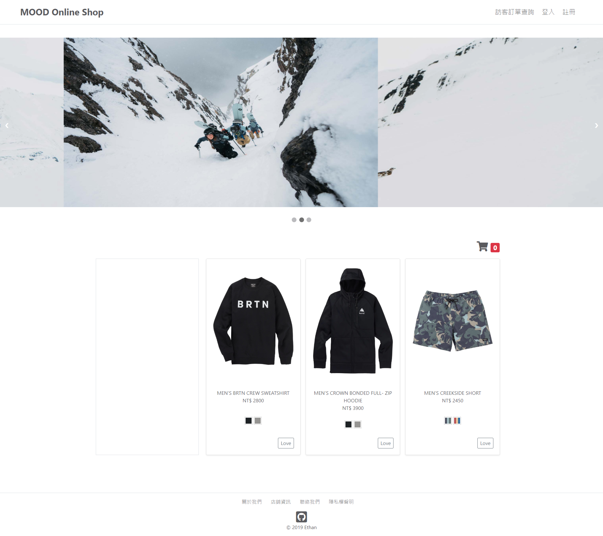

# Mood Online Shop
為滿足消費者不想登入購買的需求，於是以訪客消費的方式，建立起 Mood Online Shop。

## 目錄
- [預覽](#預覽)
- [目標](#目標)
- [原型](#原型)
- [實體關聯模型](#實體關聯模型)
- [使用者故事](#使用者故事)
- [環境建置](#環境建置)
- [使用方式](#使用方式)
- [製作者](#製作者)

## 預覽


## 目標
* 完成使用者故事
  * 訪客可以輸入訂單編號及 Email 查詢訂單進度
* 開發
  * 持續將 Controllers 重構成 Repositories and Services
  * deploy 至 heroku，使用 clearDB
* Bugs
  * 若 delete cartItem 之前修改地址等欄位，將無法帶回上一次地址等資料

## 原型
* [Wireframe - 參考網站](https://klf-shopping.com/burton/men/apparel-accessories/jackets-outerwear.html)
* [Flow Chart - 待補](https://www.lucidchart.com/invitations/accept/ec23c936-5ac6-438d-bae5-b4c6f6927594)

## 實體關聯模型
* [ERD](https://www.lucidchart.com/invitations/accept/5cb19c28-f028-41e9-a3db-5a12faa7d4b8)

## 使用者故事

* [細節清單](https://docs.google.com/spreadsheets/d/17A2yMwOYG7XeAdrV8trydgnE32LchVNWxaAVCoWyoOw/edit?usp=sharing)

### 註冊／登入／登出
* 訪客可以使用 Email 註冊會員
* 訪客可以使用 Email 登入
* 會員可以登出

### 商品瀏覽
* 訪客可以瀏覽商品列表
* 訪客可以查看單一商品
* 訪客在商品列表頁可以查看不同顏色的商品照片
* 訪客在單一商品頁可以查看不同顏色的商品照片
* 訪客可以切換 banner

### 購物車
* 訪客可以將商品放入購物車
* 訪客在 cart 頁可以查看購買商品清單
* 訪客在庫存足夠時，可以增加購物車中的商品數量
* 訪客在庫存足夠時，可以減少購物車中的商品數量
* 訪客在庫存不足時，無法將商品加入購物車
* 訪客可以移除購物車中的商品
* 訪客在 cart 頁可以預估運費

### 訂單
* 訪客在 checkout 頁可以查看購買商品清單
* 訪客在 checkout 頁可以輸入配送資訊
* 訪客在 checkout 頁可以輸入付款資訊
* 訪客在 checkout 頁可以查看訂單資訊做最後確認
* 訪客在 checkout 頁可以完成商品訂購

### 通知
* 訪客完成商品訂購後，可以收到訂單成功的通知信

### 金流
* 訪客可以透過藍新金流完成信用卡付款

## 環境建置
* 前端
  * Handlebars 
* 後端
  * Database: MySQL
  * Runtime: Node.js
  * Framwork: Express.js

## 使用方式
1. Clone 專案，請於 `Console` 輸入指令
  * Clone 至本地端
    ```
    https://github.com/HuangMinShi/Moody-Online-Shop.git
    ```
  * 切換至專案資料夾
    ```
    cd Moody-Online-Shop
    ``` 
  * 安裝套件（請參考 package.json）
    ``` 
    npm install
    ``` 
  * 開啟專案
    ``` 
    code .
    ``` 
    
2. 新增環境設定檔，請參考 `.env.example` 於專案根目錄新增 `.env` 檔，其內容如下 

```
GMAIL_USER=gmail_user
GMAIL_PASS=gmail_pass

HOST_URL=from_ngrok
MERCHANT_ID=newebpay_id
HASH_KEY=newebpay_key
HASH_IV=newebpay_iv
```

3. 修改資料庫 config
  * 路徑：./config/config.json
  * 修改內容：development 中的 password

  ```json
  "development": {
    "username": "root",
    "password": "password",
    "..."
  },
  ```


4. 資料庫設定
  * 新增資料庫，於 MySQL Workbench 輸入指令
  ```SQL
  DROP DATABASE IF EXISTS ec_web;
  CREATE DATABASE ec_web;
  USE ec_web;
  ```

  * 建立表格與種子資料，於 `Console` 輸入指令
  ```
  npx run migrate
  ```

5. 啟動
  * 啟動專案，請在 `Console` 輸入下方指令
  ```
  npm run dev
  ```

6. 本地端啟動程式
  * IP Address
    * http://localhost:3000/
  * User Account / Password


## 製作者
* [Ethan Huang](https://github.com/HuangMinShi)